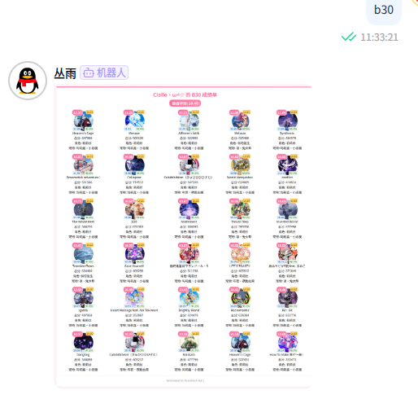

<!-- markdownlint-disable MD026 MD031 MD033 MD036 MD041 MD046 MD047 MD051 -->
<div align="center">
  
  <br>
  <p></p>
</div>

<div align="center">

# nonebot_plugin_md

_✨游戏慕斯快跑(muse dash)查询✨_


<a href ="LICENSE"> 

</a>

<a href="https://pypi.python.org/pypi/nonebot_plugin_md">

</a>
</br>
  <a href="https://github.com/astral-sh/ruff">
    
  </a>
  <a href="https://github.com/psf/black">
    
  </a>

    

</br>
<a href="http://qm.qq.com/cgi-bin/qm/qr?_wv=1027&k=0u2VnosCsDG05IPlQ4SvhCTVLpWqyEqZ&authKey=zEfR1qR358aH4bksKXMwns3nNd1r395ignXLDExp2xG8ENaIzgrAd6%2FRRAo%2B8QR2&noverify=0&group_code=424506063">
        
</a>

</div>

## 说明

使用从MuseDash.moe摸来的数据及api开发的喵斯查分bot，可以实现绑定qq和md账号、查询b30、查询曲目信息、查询难度排行等功能

### 截图展示



## 主要功能

- 1. 初始化 发送`md update`
- 2. 绑定 发送`md bindname xxx` 或者 `md binduid xxx`
- 3. b30

## 使用

```base
/md help呼出此菜单
/md b30:查询当前qq绑定账号b30
/md update:更新曲库及难度表，首次使用需要更新
/md binduid uid:使用指定uid与当前qq进行绑定\n"

/md bindname 名字:使用指定名字账号与当前qq进行绑定，搜索结果不唯一时无法绑定
/md unbind:解除当前qq账号绑定
/md b30name 名字:查询指定名字账号b30，搜索结果不唯一时返回第一个结果
/md dif 等级:查询指定等级难度排行
/md song 曲目名称:查询指定歌曲信息，支持模糊匹配
```

## 配置(env)

```env
# 启用b30快捷指令
is_b30=true
```


## 安装

以下提到的方法 任选**其一** 即可

<details open>
<summary>[推荐] 使用 nb-cli 安装</summary>
在 nonebot2 项目的根目录下打开命令行, 输入以下指令即可安装

```bash
nb plugin install nonebot_plugin_md
```

</details>

<details>
<summary>使用包管理器安装</summary>
在 nonebot2 项目的插件目录下, 打开命令行, 根据你使用的包管理器, 输入相应的安装命令

<details>
<summary>pip</summary>

```bash
pip install nonebot-plugin-md
```

</details>
<details>
<summary>pdm</summary>

```bash
pdm add nonebot-plugin-md
```

</details>
<details>
<summary>poetry</summary>

```bash
poetry add nonebot-plugin-md
```

</details>
<details>
<summary>conda</summary>

```bash
conda install nonebot-plugin-md
```

</details>
</details>

## 其他

- 本项目原因是几乎找不到开源的md查询插件，因此自己做个开源的，欢迎大佬提iss和pr
- 如果本插件对你有帮助，不要忘了点个Star~
- 本项目仅供学习使用，请勿用于商业用途
- [更新日志](./docs/update.md)
- [AGPL-3.0 License](https://github.com/Agnes4m/nonebot_plugin_md/blob/main/LICENSE) ©[@Agnes4m](https://github.com/Agnes4m)

## 🌐 感谢

- [MDbot](https://github.com/Doctorade/MDBot)- 源代码来源
